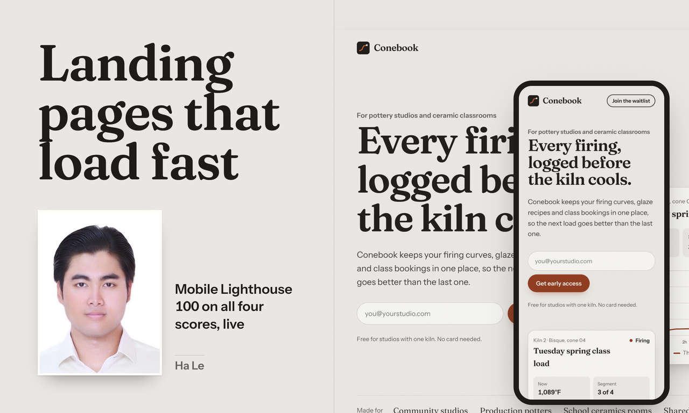
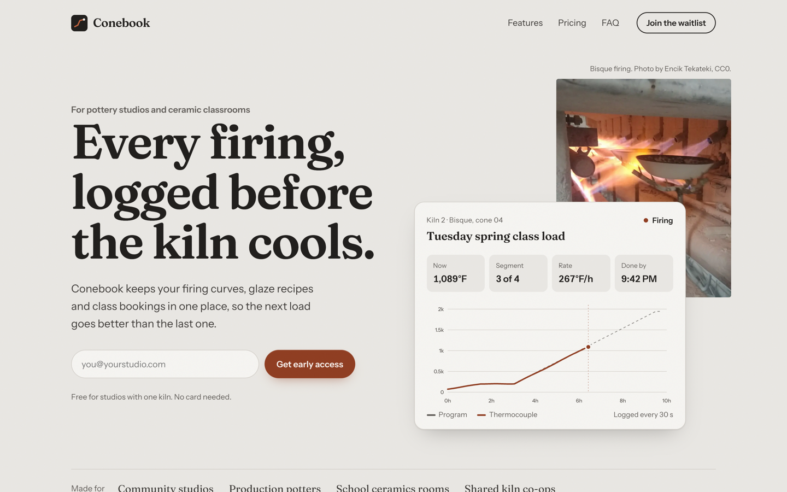
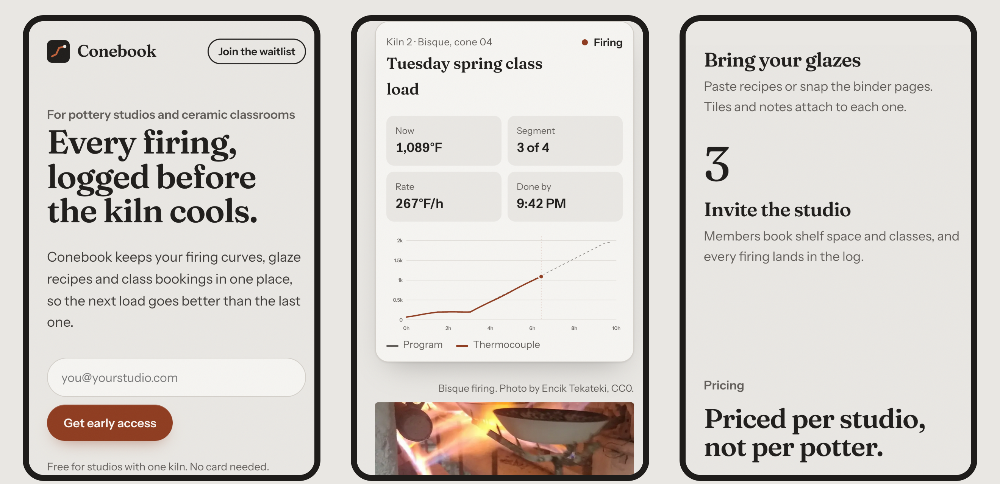
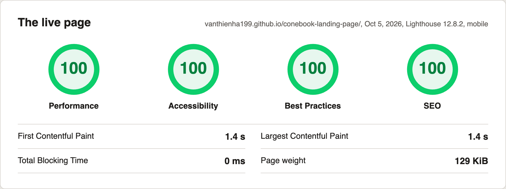
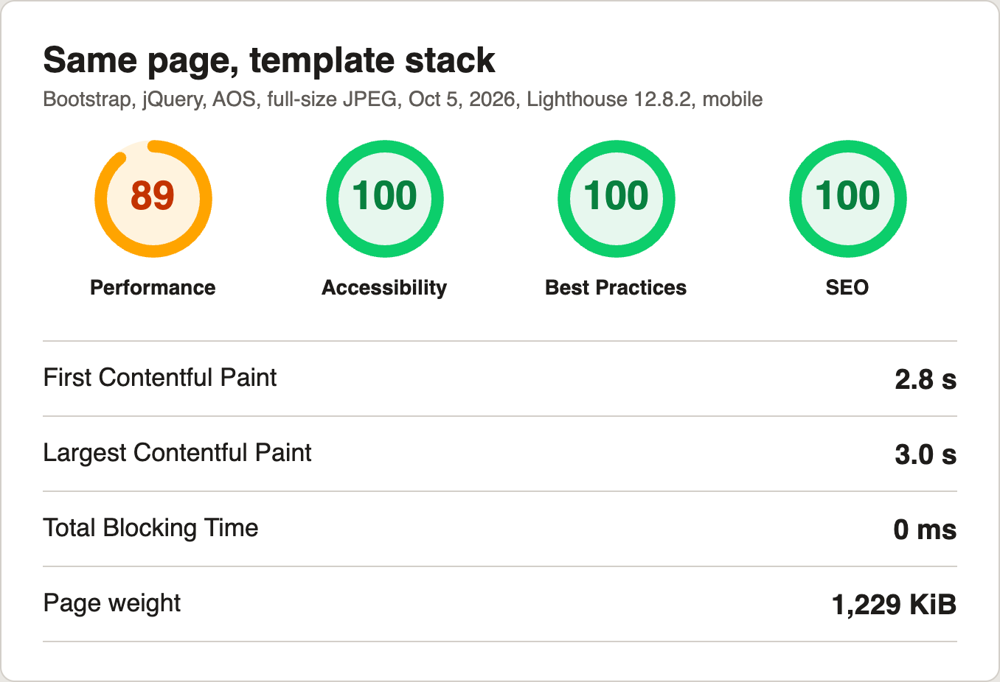

# Conebook, a landing page demo

**Live:** https://vanthienha199.github.io/conebook-landing-page/

A fast, hand-designed landing page for Conebook, a fictional logbook app for pottery studios. It is a static Astro site with self-hosted fonts, no UI framework and only a few lines of JavaScript, and it scores 100 in all four Lighthouse categories on mobile in 4 of 5 runs against the live URL on Oct 5, 2026 (the fifth scored 99 on Performance; one full report is in `docs/lighthouse-mobile-report.html`). For comparison, the same page with Bootstrap, jQuery, an animate-on-scroll library, Google Fonts and a full-size JPEG added (`tools/template_variant.py` in the demo folder) scored 89 on Performance and weighed 1,229 KiB against 161 KiB, both served locally. The two waitlist forms validate inline, use a honeypot for bots, post to Netlify Forms when deployed on Netlify, and fall back to a plain POST to `/thanks/` without JavaScript.

Run it with `npm install && npm run dev`, and build with `npm run build` (output in `dist/`). It deploys two ways: GitHub Actions publishes it to GitHub Pages on every push (`.github/workflows/pages.yml`, with `BASE_PATH` set for the project subpath), or point Netlify at this folder with `netlify.toml` and form entries appear under Forms in the Netlify dashboard. On any other static host, set `PUBLIC_FORM_ENDPOINT` to a form backend URL at build time.

Conebook is not a real product. This site was built by Ha Le as a website demo, and the brand, copy and data on it are invented.

The kiln photo is "Bisque Firing or Biscuit Firing" by Encik Tekateki on Wikimedia Commons, released under CC0 (public domain dedication). It is cropped and resized into `public/kiln-480.webp` and `public/kiln-768.webp`. Fonts are Fraunces and Instrument Sans, both under the SIL Open Font License.

